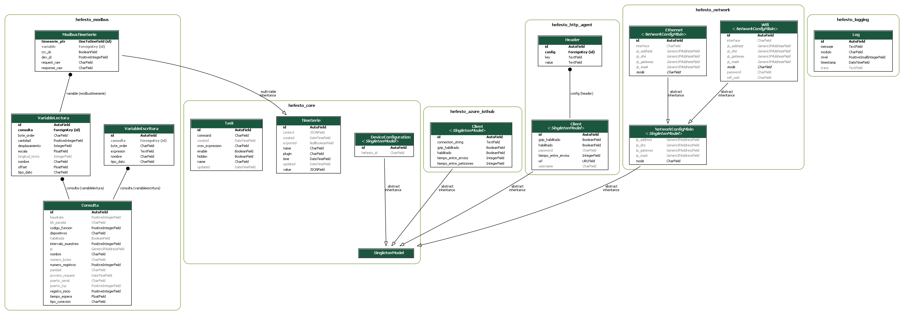

# Hefesto
Hefesto es un software de adquisicion de datos para dispositivos edge-computing de alto nivel.

Es la base e interfaz grafica para un usuario final, que quiera adquirir datos de sensores, equipos o sistemas de informacion externos, los cuales soporten protocolos industriales como [Modbus](http://www.modbus.org/) bien sea RTU, TCP o ASCI, DLMS, HTTP, MQTT entre otros.

Cuenta una arquitectura modular que permite extenderlo por medio de plugins, apps-django, que pueden ser de los siguientes tipos:

* Adquisicion datos segun cada protocol.
* Reglas que toman acciones.
* Acciones que son intepretadas segun cada protocolo.

Como herramienta de visualizacion usa [Grafana](https://grafana.com/)

## To do: 

1. Hacer la documentación
1. Hacer test
1. Imagen/Logo
1. Roadmap
    1. Meta requests en Hefesto_modbus
    1. Motor de calculos
    1. Plugins
        1. Entradas
            1. Regex serial
            1. Consumidor MQTT
        1. Salidas
            1. Reglas y ordenes
        1. Tranmision
            1. MQTT
            1. OPC
    

# Instalacion
## Requisitos
### Docker
[Get Docker](https://docs.docker.com/install/)
#### Debian/Ubuntu/Raspbian 
```bash
sudo apt install docker
sudo systemctl start docker
```

#### Fedora/Redhat/centOS
```bash
sudo yum install docker
sudo systemctl start docker
```
### Docker-compose
```bash
sudo pip install docker-compose
```
## Descargar
```bash
git clone https://github.com/DanielGnzlzVll/Hefesto 
cd Hefesto
```
## Iniciar
```bash
docker-compose up
```


### Configuracion
ir a la pagina de [Configuracion](http://localhost/hefesto/admin/)

### Estructura de la base de datos:



## Bugs
Reporta cualquier bug a mediante correo electronico o crea un [Issue!](https://github.com/DanielGnzlzVll/Hefesto/issues/new)
[jodgonzalezvi@unal.edu.co](mailto:jodgonzalezvi@unal.edu.co?subject=HefestoBug)


