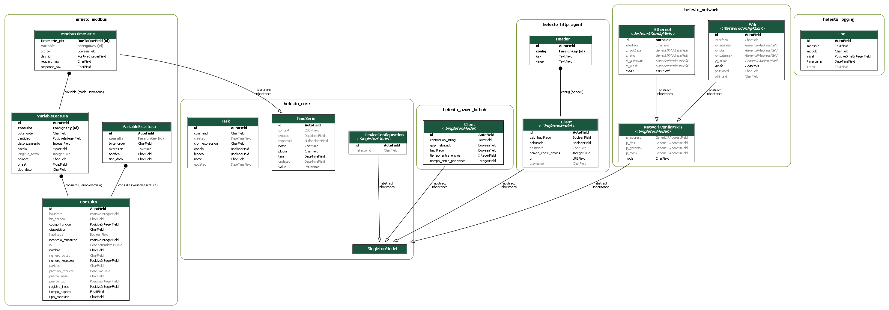

# Hefesto
Hefesto es un software de adquisicion de datos para dispositivos edge-computing de alto nivel.

Es la base e interfaz grafica para un usuario final, que quiera adquirir datos de sensores, equipos o sistemas de informacion externos, los cuales soporten protocolos industriales como [Modbus](http://www.modbus.org/) bien sea RTU, TCP o ASCI, DLMS, HTTP, MQTT entre otros.

Cuenta una arquitectura modular que permite extenderlo por medio de plugins, apps-django, que pueden ser de los siguientes tipos:

* Adquisicion datos segun cada protocol.
* Reglas que toman acciones.
* Acciones que son intepretadas segun cada protocolo.

Como herramienta de visualizacion usa [Grafana](https://grafana.com/)

## To do: 

1. Hacer la documentación
1. Hacer test
1. Imagen/Logo
1. Roadmap
    1. Meta requests en Hefesto_modbus
    1. Motor de calculos
    1. Plugins
        1. Entradas
            1. Regex serial
            1. Consumidor MQTT
        1. Salidas
            1. Reglas y ordenes
        1. Tranmision
            1. MQTT
            1. OPC
    


# Instalacion
## Requisitos
### Docker
[Get Docker](https://docs.docker.com/install/)
#### Debian/Ubuntu/Raspbian 
```bash
sudo apt install docker
sudo systemctl start docker
```

#### Fedora/Redhat/centOS
```bash
sudo yum install docker
sudo systemctl start docker
```
### Docker-compose
```bash
sudo pip install docker-compose
```
## Descargar
```bash
git clone https://github.com/DanielGnzlzVll/Hefesto 
cd Hefesto
```
## Variables de entorno
Crear un archivo `.env` (no versionado) a partir de `.env.example`, con una contraseña unica por dispositivo:
```bash
echo "HEFESTO_DB_PASSWORD=$(openssl rand -hex 24)" > .env
```

| Variable | Requerida | Descripcion |
|---|---|---|
| `HEFESTO_DB_PASSWORD` | Si | Contraseña de PostgreSQL, usada por `postgres`, `grafana`, `migrate`, `webapp` y `processor`. La aplicacion no inicia sin ella. |
| `HEFESTO_DB` | No | Nombre de la base de datos (por defecto `hefestodb`). |
| `HEFESTO_DB_USER` | No | Usuario de la base de datos (por defecto `hefesto`). |
| `HEFESTO_DB_HOST` | No | Host de la base de datos (por defecto `postgres`). |
| `HEFESTO_DB_PORT` | No | Puerto de la base de datos. |
| `DJANGO_SECRET_KEY` | No | Clave secreta de Django (por defecto se genera una aleatoria en cada inicio). |
| `DJANGO_ALLOWED_HOSTS` | No | Hosts permitidos separados por comas (por defecto `localhost,127.0.0.1,hefesto,hefesto.local,192.168.1.212,192.168.137.212`). Añadir la IP o nombre con el que se accede al dispositivo. |
| `DJANGO_DEBUG` | No | `1` para activar el modo debug de Django (desactivado por defecto). |

`POSTGRES_PASSWORD` solo se aplica al crear el volumen `pgdata`. Para cambiar la contraseña en un dispositivo ya desplegado:
```bash
docker-compose exec postgres psql -U hefesto -d hefestodb -c "ALTER USER hefesto WITH PASSWORD '<nueva>';"
```
y luego actualizar `HEFESTO_DB_PASSWORD` en `.env` y ejecutar `docker-compose up -d`.

## Iniciar
```bash
docker-compose up
```


### Configuracion
ir a la pagina de [Configuracion](http://localhost/hefesto/admin/)

### Estructura de la base de datos:



## Bugs
Reporta cualquier bug a mediante correo electronico o crea un [Issue!](https://github.com/DanielGnzlzVll/Hefesto/issues/new)
[jodgonzalezvi@unal.edu.co](mailto:jodgonzalezvi@unal.edu.co?subject=HefestoBug)


