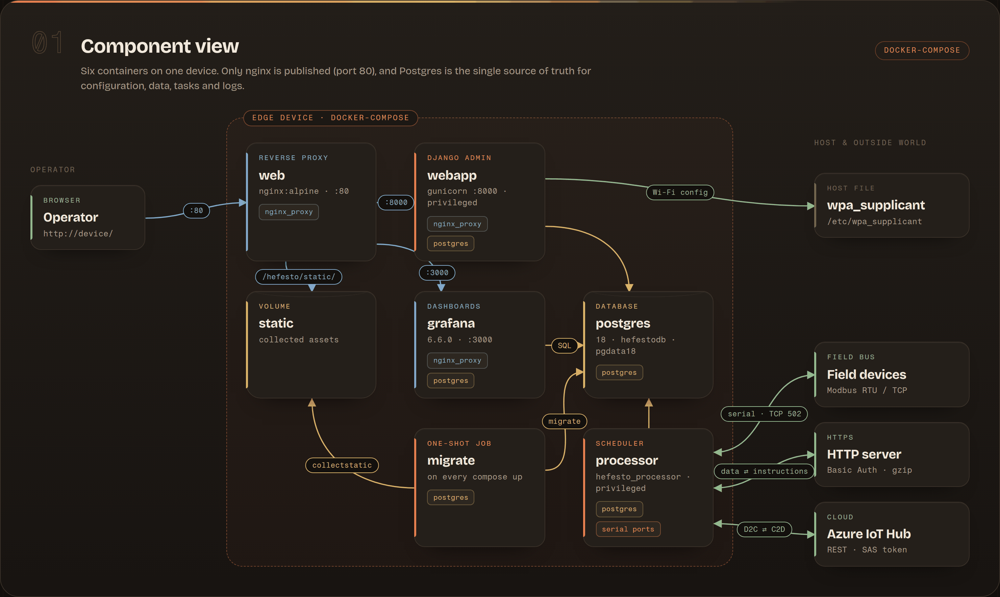
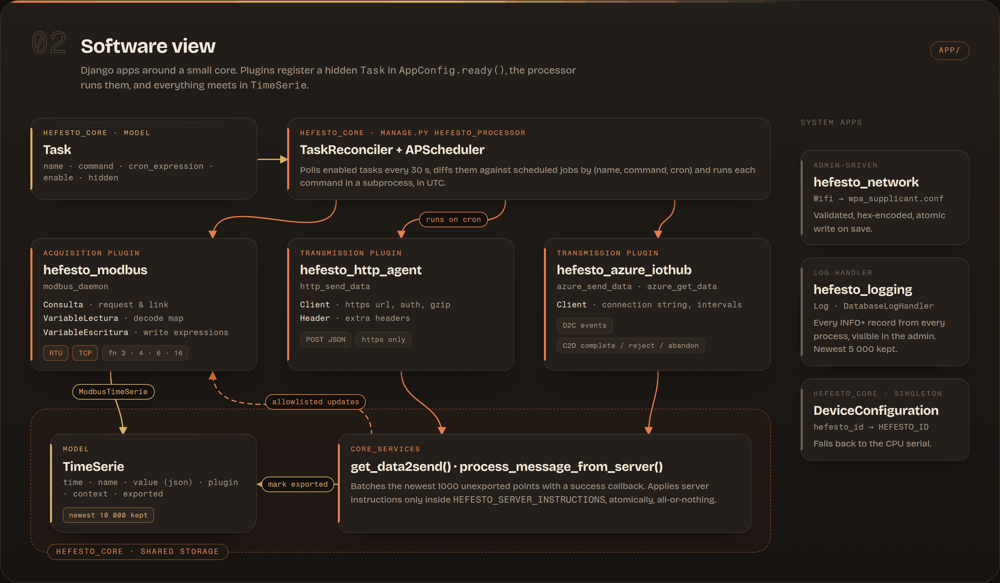
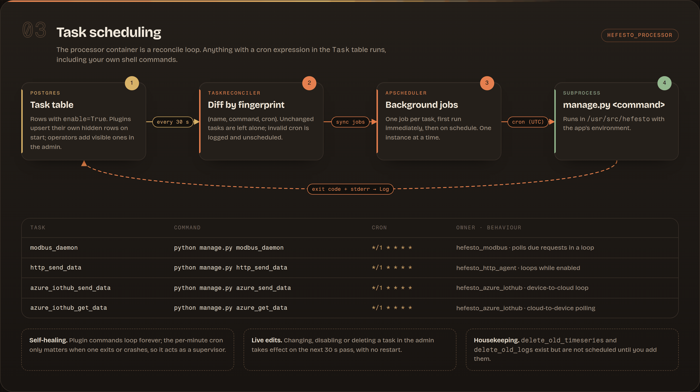
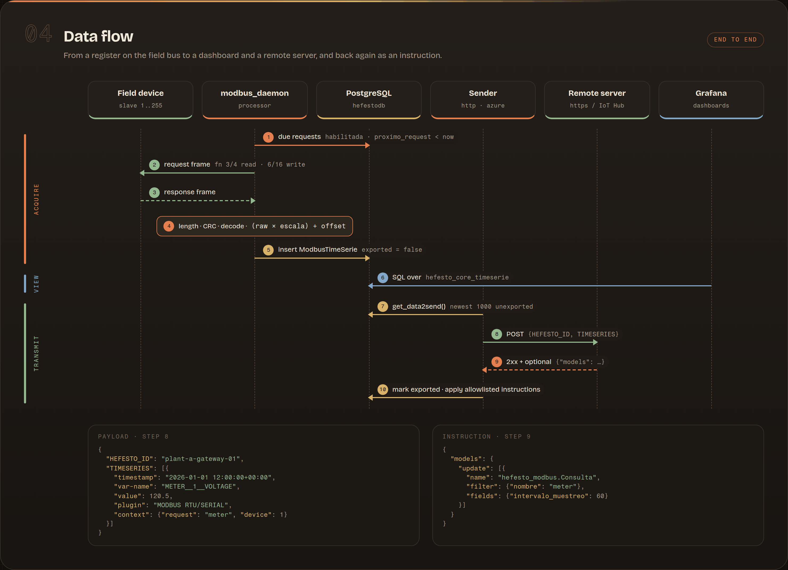
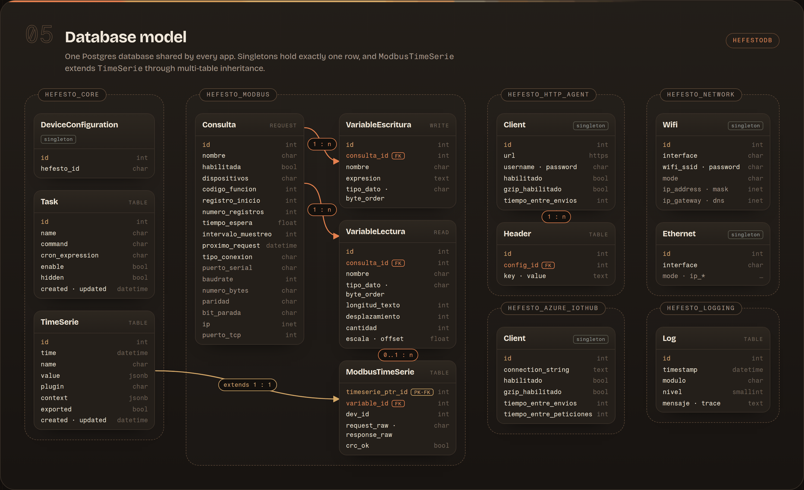

# Architecture

Hefesto runs on a single edge device (typically a Raspberry Pi) as a set of Docker containers orchestrated by `docker-compose`. All state lives in one PostgreSQL database: configuration, acquired time series, scheduled tasks and logs.

The diagrams are built in [`diagrams/architecture.html`](diagrams/architecture.html); open it in a browser for the interactive version (hover a box to highlight its connections). After editing it, regenerate the images with `npx -y -p puppeteer node docs/diagrams/render.mjs`.

## Component view



| Service | Image | Role |
|---|---|---|
| `web` | `nginx:alpine` | Only service exposed on the host (port 80). Routes `/hefesto/` to `webapp`, `/grafana/` to `grafana`, serves `/hefesto/static/`, and redirects `/` to the admin. |
| `webapp` | `hefesto` (built from `App/`) | Django admin used to configure everything. Runs privileged with `/etc/wpa_supplicant` mounted so saving the Wi-Fi form reconfigures the host. |
| `processor` | `hefesto` | Runs `manage.py hefesto_processor`, the scheduler that executes every enabled `Task` (acquisition, transmission, housekeeping). Privileged to reach serial ports. |
| `migrate` | `hefesto` | One-shot job: `collectstatic` + `migrate` on every `up`. |
| `postgres` | `postgres:18-alpine` | Single source of truth. Data persisted in the `pgdata18` volume. |
| `grafana` | `grafana/grafana:6.6.0` | Dashboards over the `Postgres` datasource provisioned from `grafana/provisioning`. |

Two Docker networks isolate traffic: `nginx_proxy` (web, webapp, grafana) and `postgres` (everything that talks to the database). The database is never exposed outside the device.

Every container mounts `./App` from the host, so a `git pull` on the device updates the code; `every_hour.sh` and `after_reboot.sh` do this from cron and restart or rebuild the containers when something changed.

## Software view

The Django project in `App/` is split into plugin apps around a small core.



### Apps

| App | Responsibility | Main models | Commands |
|---|---|---|---|
| `hefesto_core` | Shared time series storage, task scheduler, device identity, server-instruction processing. | `TimeSerie`, `Task`, `DeviceConfiguration` | `hefesto_processor`, `delete_old_timeseries` |
| `hefesto_modbus` | Modbus RTU (serial) and TCP polling: builds frames, validates CRC/length, decodes registers, evaluates write expressions. | `Consulta`, `VariableLectura`, `VariableEscritura`, `ModbusTimeSerie` | `modbus_daemon`, `modbus_procesar_consultas` |
| `hefesto_http_agent` | Pushes unexported time series to an HTTPS endpoint (Basic Auth, custom headers, optional gzip). | `Client`, `Header` | `http_send_data` |
| `hefesto_azure_iothub` | Device-to-cloud messages and cloud-to-device polling against Azure IoT Hub REST API with SAS tokens. | `Client` | `azure_send_data`, `azure_get_data` |
| `hefesto_network` | Writes the Wi-Fi network into `wpa_supplicant.conf` atomically when the form is saved. | `Wifi` | `config_wifi` |
| `hefesto_logging` | Stores every `INFO`+ log record in the database so it is visible in the admin. | `Log` | `delete_old_logs` |

### Plugin contract

A plugin is a Django app added to `INSTALLED_APPS` that follows these conventions:

1. **Configuration** is exposed as models registered in the admin (singletons via `django-solo` for one-per-device settings).
2. **Work** is a management command. In `AppConfig.ready()` the app does `Task.objects.get_or_create(...)` with `hidden=True`, a `command` such as `python manage.py modbus_daemon` and a `cron_expression`. Hidden tasks are not shown in the admin task list.
3. **Acquired data** is written as `TimeSerie` rows (or a subclass through multi-table inheritance, like `ModbusTimeSerie`) with a unique `name`, a JSON `value`, the `plugin` label and a free-form `context`.
4. **Transmission** plugins call `core_services.get_data2send()`, which returns the newest 1000 unexported points, a callback that marks them as `exported` after a successful send, and the processor for instructions returned by the server.

### Task scheduling



The long-running plugin commands (`modbus_daemon`, `http_send_data`, `azure_*`) loop internally, and APScheduler does not start a new instance of a job while the previous run is still going. The per-minute cron therefore acts as a supervisor that restarts the loop if it exits or crashes.

## Data flow



### Transmitted payload

```json
{
  "HEFESTO_ID": "<DeviceConfiguration.hefesto_id or CPU serial>",
  "TIMESERIES": [
    {
      "timestamp": "2026-01-01 12:00:00+00:00",
      "var-name": "METER__1__VOLTAGE",
      "value": 120.5,
      "plugin": "MODBUS RTU/SERIAL",
      "context": {"request": "meter", "var_name": "voltage", "device": 1}
    }
  ]
}
```

### Server instructions

The HTTP response body (HTTPS only) or an Azure cloud-to-device message may carry instructions:

```json
{
  "models": {
    "update": [
      {
        "name": "hefesto_modbus.Consulta",
        "filter": {"nombre": "meter"},
        "fields": {"intervalo_muestreo": 60}
      }
    ],
    "clean": []
  }
}
```

`process_message_from_server()` only accepts the models, operations and fields listed in `settings.HEFESTO_SERVER_INSTRUCTIONS`. Core Django apps, logging, network, transmission clients and `Task` are always rejected. All instructions in a message are validated first and applied in a single transaction, so an invalid instruction applies nothing. For Azure, a processed message is completed, an invalid one is rejected and a transient database error abandons it for redelivery.

### Retention

| Data | Limit |
|---|---|
| `TimeSerie` | Newest 10,000 rows kept on every insert; `delete_old_timeseries` removes rows older than 30 days. |
| `Log` | Newest 5,000 rows kept on every insert; `delete_old_logs` removes rows older than 2 days. |

The `delete_old_*` commands are not scheduled by default; add them as tasks if needed (see [Tutorials](tutorials.md#schedule-a-custom-task)).

## Database model

All apps share the `hefestodb` PostgreSQL database. Singleton models (`DeviceConfiguration`, both `Client`s, `Wifi`, `Ethernet`) hold a single row.


